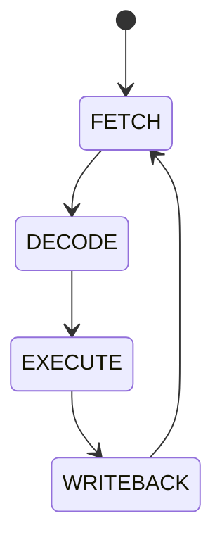
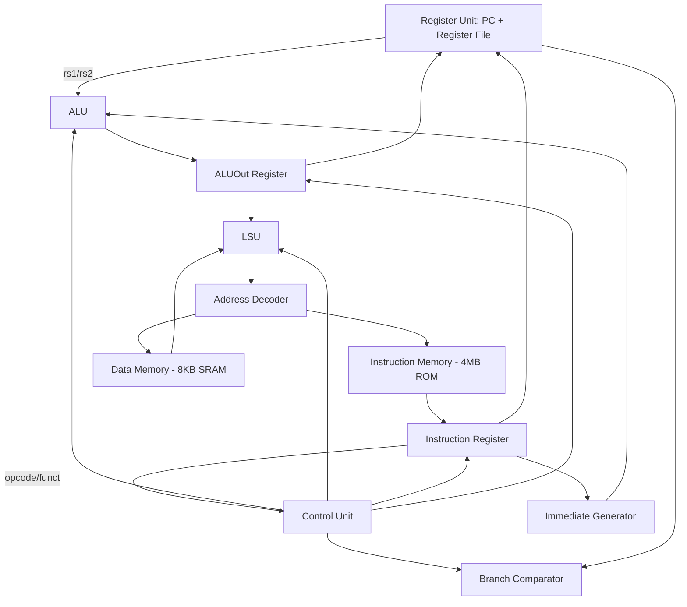

# RVBL-2 — Multicycle RISC-V Processor

*A 32-bit multicycle RISC-V microcontroller built for the ChampionCHIP eXperience — Phase 2, designed in ChipInventor Cloud EDA and targeting the Sky130 130nm PDK via OpenLane.*


-yellow)


> **Note on this README:** the Progress and ISA Coverage sections below are kept honest on purpose — including the parts that aren't finished yet. A processor design is easier to evaluate (and a better portfolio piece) when the reader can see exactly what's verified versus what's still open, rather than a list that only ever grows.

---

## Overview

RVBL-2 started from the single-cycle RISC-V core developed during ChampionCHIP training and is being extended into the multicycle architecture required for Phase 2 of the competition. It targets:

- **ISA:** RV32I base, plus the `Zmmul` (multiply-only) and a custom `Xicrc` (hardware CRC) extension — 47 target instructions across 10 categories
- **Memory:** Harvard-style split memory — 4MB instruction ROM, 8KB data SRAM, connected through a dedicated MMIO address decoder
- **Control:** a 4-state FSM (`FETCH → DECODE → EXECUTE → WRITEBACK`) sequencing a shared ALU and shared memory port across each instruction
- **Backend target:** Sky130 130nm via the OpenLane flow

## Architecture

### Control FSM



Each state is one clock cycle; every instruction takes exactly four cycles. Fetch reads the instruction from IMEM into the instruction register (IR); Decode reads the register file and decodes the opcode; Execute drives the ALU (arithmetic result, effective address, or branch/jump target) and, for loads/stores, drives the memory port; WriteBack is the only state in which the register file or PC may actually change.

### Module map



### Memory map

| Base Address | Device | Size |
|---|---|---|
| `0x00400000` | Instruction Memory (IMEM) | 4 MB |
| `0x10010000` | Data Memory (DMEM) | 8 KB |

## Module List

| Module | Role |
|---|---|
| `RISCV_FSM` | 4-state control sequencer |
| `RISCV_CONTROL_V2` | Instruction decode + FSM-gated write-enables |
| `RISCV_ALU` | Arithmetic/logic execution |
| `RISCV_IMM_GENERATOR` | Immediate extraction and sign extension |
| `RISCV_BRANCH_COMPARATOR` | Branch condition evaluation |
| `RISCV_REGISTER_UNIT_V1` | Register file + program counter |
| `RISCV_IR_V1` | Instruction register (multicycle pipeline latch) |
| `RISCV_ALUOUT_V1` | ALU result latch (multicycle pipeline latch) |
| `RISCV_LSU_v2` | Load/store byte positioning, masking, sign/zero extension |
| `RISCV_ADDRESS_DECODER` | MMIO device selection and signal routing |
| `RISCV_IMEM_v2` | 4MB instruction ROM |
| `RISCV_DMEM_v2` | 8KB synchronous data SRAM |

## ISA Coverage

47 target instructions across 10 categories, per the competition guide. Status below reflects a direct audit of the current RTL against that spec — not just "opcode exists in a table somewhere."

| Category | Expected | ✅ Correct | ⚠️ Decoded but wrong result | ❌ Not implemented |
|---|---|---|---|---|
| Arithmetic/Logic (Register) | 10 | 5 — ADD, SUB, AND, OR, XOR | 5 — SLL, SLT, SLTU, SRL, SRA | 0 |
| Arithmetic/Logic (Immediate) | 9 | 4 — ADDI, ANDI, ORI, XORI | 5 — SLLI, SLTI, SLTIU, SRLI, SRAI | 0 |
| Load | 5 | 5 — LB, LH, LW, LBU, LHU | 0 | 0 |
| Store | 3 | 3 — SB, SH, SW | 0 | 0 |
| Branch | 6 | 4 — BEQ, BNE, BLT, BGE | 2 — BLTU, BGEU | 0 |
| Jump | 2 | 2 — JAL, JALR | 0 | 0 |
| Upper Immediate | 2 | 0 | 0 | 2 — LUI, AUIPC |
| System / Synchronization | 3 | 0 | 0 | 3 |
| Multiplication (Zmmul) | 4 | 0 | 0 | 4 — MUL, MULH, MULHSU, MULHU |
| CRC (Xicrc) | 3 | 0 | 0 | 3 — CRCB, CRCH, CRCW |
| **Total** | **47** | **23 (~49%)** | **12 (~26%)** | **12 (~26%)** |

**"Decoded but wrong result"** means the instruction runs without any error and silently produces the wrong value (e.g. `sll` currently executes as `and`) — flagged separately from "not implemented" because it's the more dangerous failure mode of the two.

## Known Issues

- **[Open] Instruction fetch does not read a real address.** The address decoder's address/read-enable inputs are wired only from the load/store unit, with no path for the program counter to reach the memory bus during Fetch. A fix (a PC-vs-ALUOut select mux on the memory address bus, similar to the classic `IorD` signal) has been designed but is **not yet confirmed applied and verified in simulation.**
- Shift and compare ALU operations (`SLL`/`SRL`/`SRA`/`SLT`/`SLTU`) have no hardware in the ALU itself yet, independent of decode.
- The immediate generator has no U-type case, so `LUI`/`AUIPC` cannot produce a correct immediate even if decode were added.
- The branch comparator is signed-only, so `BLTU`/`BGEU` evaluate the wrong condition.
- No multiplier or CRC block is instantiated yet — `Zmmul` and `Xicrc` are specification targets only.

## Getting Started

```bash
# Simulate a module or the top-level design with Icarus Verilog
iverilog -o sim.out top.v <module_files>.v testbench.v
vvp sim.out

# View waveforms
gtkwave dump.vcd

# Assemble a RISC-V test program for this core
riscv64-linux-gnu-as -march=rv32i -mabi=ilp32 -o prog.o prog.s
riscv64-linux-gnu-objcopy -O binary prog.o prog.bin
# then convert prog.bin to a $readmemh-compatible hex image for IMEM
```

> Design entry itself happens in **ChipInventor Cloud EDA (v3.15)** as a block diagram — `hdl.v` is a generated export and should not be hand-edited, since it's overwritten on every regeneration. Fixes belong in the block diagram.

## Progress

- [x] Single-cycle → multicycle conversion: FSM, state-gated control signals
- [x] Instruction register and ALU-output pipeline latches
- [x] Immediate generator (I/S/B/J-type)
- [x] Branch comparator (signed BEQ/BNE/BLT/BGE)
- [x] Load/store unit — full byte/half-word/word load with sign/zero extension, full store with byte positioning and write masking
- [x] MMIO address decoder for split IMEM/DMEM memory map
- [x] Instruction memory (4MB ROM) and data memory (8KB synchronous SRAM)
- [x] Top-level netlist wired and connectivity-audited (no blank ports, no duplicate/undriven real inputs)
- [x] Directed self-checking testbench infrastructure with cycle-level tracing
- [x] Scope-restricted test program (ADD/SUB/ADDI/BEQ/JAL Fibonacci) assembled and used to isolate datapath/FSM bugs from ISA-coverage gaps
- [ ] **Fetch-stage PC → memory bus path — designed, not yet verified working in simulation**
- [ ] Full ALU op set (shift, set-less-than) implemented in hardware
- [ ] `LUI` / `AUIPC` support (needs U-type immediate generation)
- [ ] Unsigned branch comparisons (`BLTU`/`BGEU`)
- [ ] `Zmmul` multiplier block
- [ ] `Xicrc` CRC block
- [ ] SYSTEM/synchronization instructions
- [ ] Full-ISA regression test program
- [ ] OpenLane synthesis, area/density results, GDSII
- [ ] Submission report, video demo

## Future Work / Roadmap

<!-- TODO -->

## Acknowledgments

Built as part of the ChampionCHIP eXperience, using the single-cycle RISC-V core from ChampionCHIP training as the Phase 2 starting point, per the competition's own submission guide.
